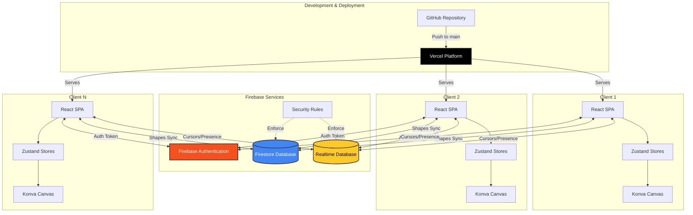
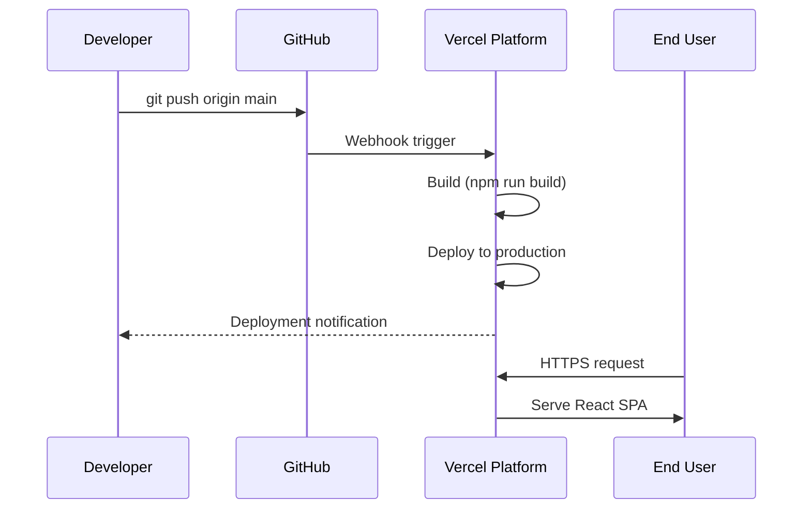
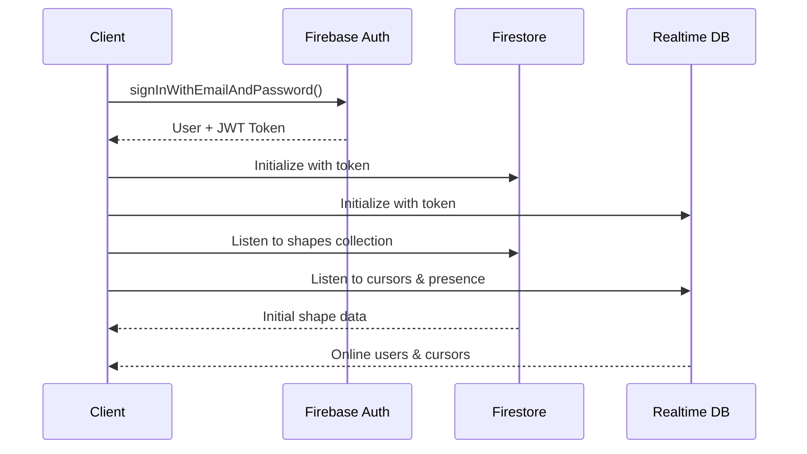
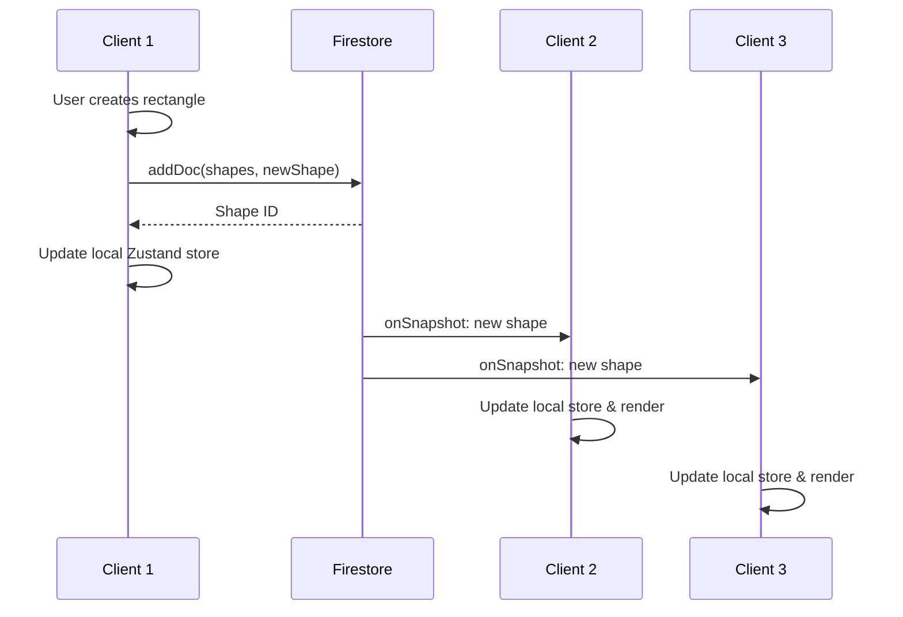
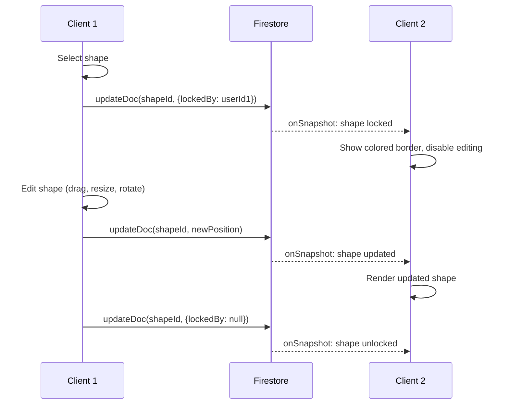
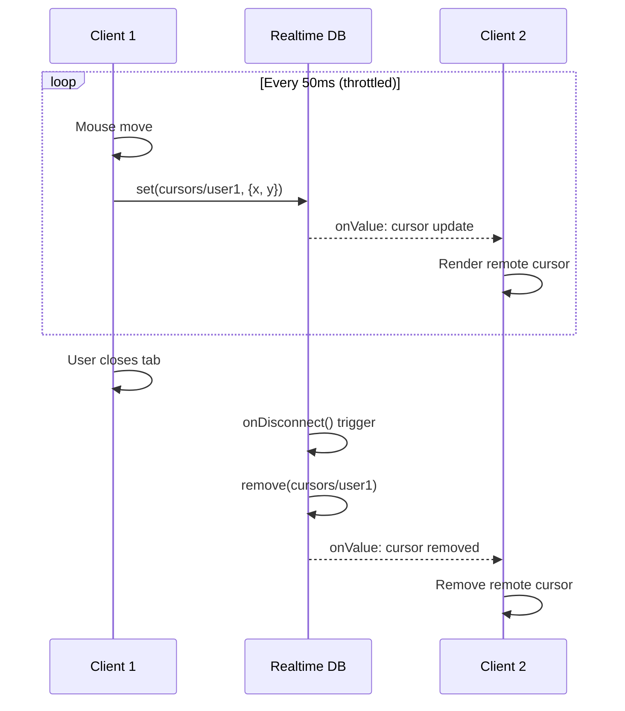
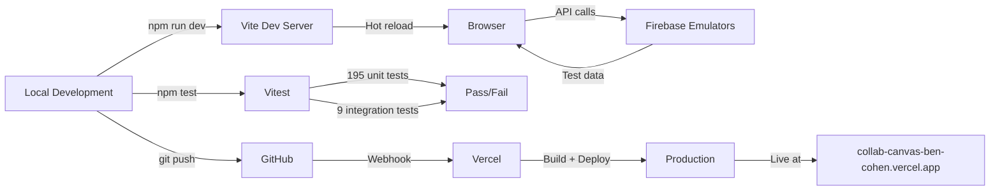

# CollabCanvas Architecture

## System Overview

CollabCanvas is a real-time collaborative whiteboard application with a clear separation between persistent data (shapes) and ephemeral data (cursors/presence). The architecture leverages Firebase services for backend infrastructure while maintaining a stateless frontend deployed on Vercel.

## High-Level Architecture



## Component Responsibilities

### Frontend (React + TypeScript)

**React SPA**
- Single-page application built with Vite
- Handles UI rendering, user interactions, and local state
- Hosted on Vercel with automatic deployments from GitHub

**Zustand Stores**
- `useUserStore`: User authentication state and profile
- `useShapeStore`: Local shape data synced with Firestore
- `useCursorStore`: Cursor positions and presence data

**React Konva**
- Canvas rendering engine for shapes and cursors
- Handles pan/zoom, shape manipulation, and visual feedback
- Optimized for 60 FPS with inverse scaling for constant-size elements

### Backend (Firebase)

**Firebase Authentication**
- Email/password authentication
- Issues JWT tokens for authenticated requests
- Tokens automatically attached to Firestore/RTDB requests

**Firestore Database** (Persistent Data)
- `shapes` collection: Rectangle data (position, size, rotation, color, locks)
- `users` collection: User profiles (display name, color)
- Real-time listeners for live collaboration
- Optimistic updates with eventual consistency

**Realtime Database** (Ephemeral Data)
- `cursors/{userId}`: Current cursor position (x, y)
- `presence/{userId}`: Online status with heartbeat
- Low-latency updates (~50ms throttle)
- Automatic cleanup on disconnect

**Security Rules**
- Deployed via Firebase CLI (`firebase deploy --only firestore:rules,database:rules`)
- Firestore: Authenticated users can read all shapes, write only unlocked shapes
- RTDB: Authenticated users can read all presence, write only their own cursor/presence

### Deployment Pipeline



## Data Flow Patterns

### Authentication Flow



### Shape Creation & Sync



### Shape Locking (Conflict Prevention)



### Cursor Tracking



## Key Design Decisions

### Persistent vs. Ephemeral Data Split

**Why Firestore for shapes?**
- Shapes must persist across sessions
- Complex queries and indexing needed
- Transactional updates for locking mechanism
- Better suited for structured, relational data

**Why Realtime DB for cursors?**
- Cursors are ephemeral (no persistence needed)
- Lower latency than Firestore (~50ms vs ~200ms)
- Simple key-value structure
- Built-in `onDisconnect()` for automatic cleanup

### Locking Strategy

**Optimistic UI Updates**
- User sees immediate feedback on their actions
- Backend sync happens in background
- Conflicts prevented by `lockedBy` field

**Lock Lifecycle**
1. User selects shape → Lock acquired
2. User edits shape → Updates synced to Firestore
3. User deselects or closes tab → Lock released
4. Other users see colored border when locked

### Performance Optimizations

- **Throttled cursor updates**: 50ms (~20Hz) prevents excessive writes
- **Inverse scaling**: UI elements maintain constant size during zoom
- **Optimistic updates**: Local state updates immediately, sync in background
- **onDisconnect handlers**: Automatic cleanup prevents stale presence data

## Technology Stack

| Layer | Technology | Purpose |
|-------|-----------|---------|
| Frontend Framework | React 18 + TypeScript | UI rendering and type safety |
| Build Tool | Vite | Fast development and optimized builds |
| State Management | Zustand | Lightweight, performant stores |
| Canvas Rendering | React Konva | Hardware-accelerated 2D graphics |
| Styling | TailwindCSS | Utility-first CSS framework |
| Authentication | Firebase Auth | User management and JWT tokens |
| Persistent Storage | Firestore | Shape data and user profiles |
| Ephemeral Storage | Realtime Database | Cursors and online presence |
| Hosting | Vercel | Static site hosting with CDN |
| Testing | Vitest | Unit and integration tests |

## Security Model

### Firestore Rules

```javascript
rules_version = '2';
service cloud.firestore {
  match /databases/{database}/documents {
    // Users must be authenticated
    match /{document=**} {
      allow read: if request.auth != null;
    }
    
    // Shapes: Can only modify if not locked by another user
    match /shapes/{shapeId} {
      allow create: if request.auth != null;
      allow update: if request.auth != null && 
        (resource.data.lockedBy == null || 
         resource.data.lockedBy == request.auth.uid);
      allow delete: if request.auth != null &&
        (resource.data.lockedBy == null ||
         resource.data.lockedBy == request.auth.uid);
    }
    
    // Users: Can only write own profile
    match /users/{userId} {
      allow write: if request.auth != null && request.auth.uid == userId;
    }
  }
}
```

### Realtime Database Rules

```json
{
  "rules": {
    ".read": "auth != null",
    ".write": false,
    "cursors": {
      "$userId": {
        ".write": "auth != null && auth.uid == $userId"
      }
    },
    "presence": {
      "$userId": {
        ".write": "auth != null && auth.uid == $userId"
      }
    }
  }
}
```

## Scalability Considerations

### Current Limitations

- **Firestore writes**: ~1 write/second per user (shape updates)
- **RTDB writes**: ~20 writes/second per user (cursor updates)
- **Concurrent users**: No hard limit, scales with Firebase pricing tier

### Future Optimizations

- **Batch shape updates**: Combine multiple shape changes into single Firestore write
- **Cursor sampling**: Further reduce cursor update frequency for large rooms
- **Spatial partitioning**: Only sync shapes/cursors in viewport
- **Connection pooling**: Reuse Firebase connections across browser tabs

## Development Workflow



## Monitoring & Debugging

- **Firebase Console**: Real-time database queries, auth logs, Firestore usage
- **Vercel Dashboard**: Deployment logs, analytics, performance metrics
- **Browser DevTools**: React DevTools, Konva layer inspection, network timing
- **Vitest Coverage**: 204 tests covering stores, hooks, utilities, Firebase integration

## References

- [Firebase Documentation](https://firebase.google.com/docs)
- [React Konva Documentation](https://konvajs.org/docs/react/)
- [Zustand Documentation](https://zustand-demo.pmnd.rs/)
- [Vercel Documentation](https://vercel.com/docs)

